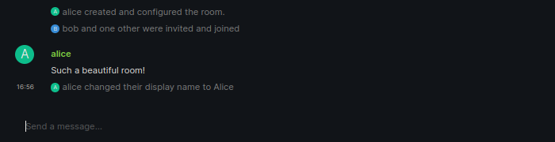
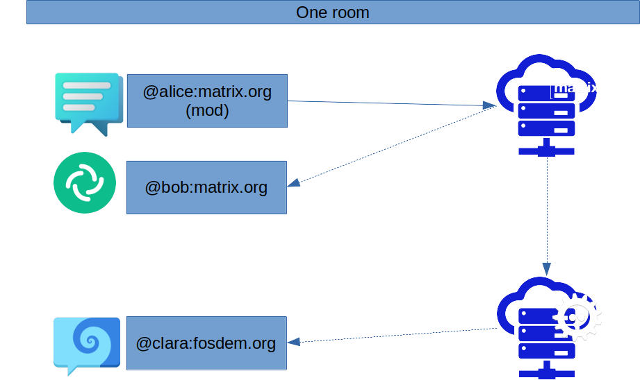
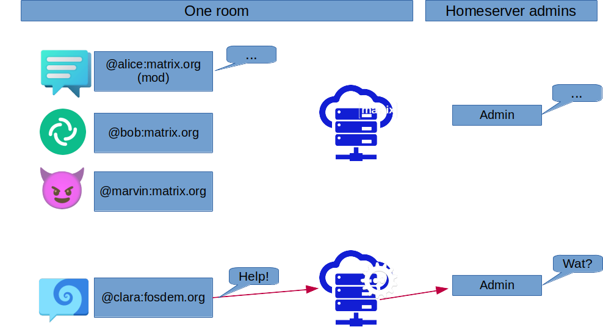
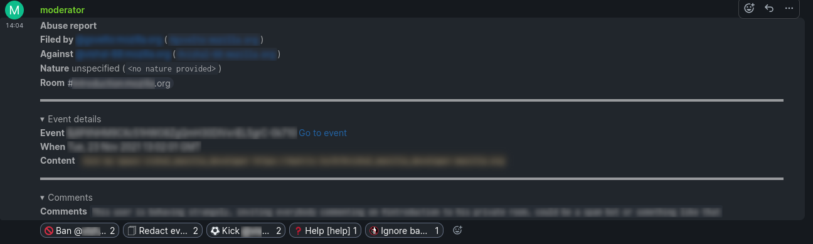
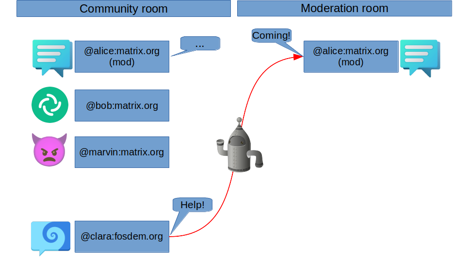

# All about Moderation

Yoric (aka David Teller), Tech Lead@Element.

Note:
Hi, I'm Yoric, aka David. I'm tech lead for moderation tools
for the Matrix ecosystem.
This is a *technical* presentation about *how* moderation works in Matrix.
Matrix is federated protocol/ecosystem, so that makes things... interesting.
Note that things are moving fast at the moment, so I hope that if I give
this presentation once again next year, it will be quite different.

---

# What *is* Moderation?

> In an internet forum, a moderator is one who enforces the *rules*.

(source: Wikipedia)

> Matrix itself doesn't know about rules. <!-- .element: class="fragment" -->

---

# The program

1. **Room moderators**.
2. Homeserver admins.
3. Mjölnir.
4. A glimpse of the future.


---

## Rooms and events



---

## Everything is an event

<!-- .slide: data-transition="convex-in" -->



---

<!-- .slide: data-transition="convex-in" -->

## View source

```jsonc
{
  "type": "m.room.member",
  "sender": "@alice:localhost:9999",
  "content": {
    "membership": "join",
    "displayname": "Alice"
  },
  "state_key": "@alice:localhost:9999",
  "origin_server_ts": 1642607768822,
  "event_id": "$cpoQNR2VRAbElwMRdUG1N_g5EXqVwrZFAilWJEY5Wmo",
  "room_id": "!lMJWVxQoCUKBVMspVO:localhost:9999",
  // ...
}
```

Note:
There is something every important to understand about Matrix. Matrix is basically
only a protocol designed to allow any number of clients and any number of servers
to agree on an (almost) write-only log of events called a room. I'm sure that
there are some people who would define this as a blockchain. There are two kinds
of events: *message events* and *state events*. Message events contain text, images,
sounds, confetti, encryption challenges, etc. State events contain the configuration of
the room, including encryption configuration, topic, aliases, etc. All participating
servers receive all messages and state events, may decide to reject them if they do
not respect the protocol, and redistribute the events to all clients.

---

## ...including power levels

```jsonc
{
  "type": "m.room.power_levels",
  "sender": "@alice:localhost:9999",
  "content": {
    "users": {
      "@alice:localhost:9999": 100
    },
    "users_default": 0,
    "events": {
      "m.room.name": 50,
      "m.room.power_levels": 100,
      "m.room.history_visibility": 100,
      "m.room.canonical_alias": 50,
      "m.room.avatar": 50,
      "m.room.tombstone": 100,
      "m.room.server_acl": 100,
      "m.room.encryption": 100
    },
    "events_default": 0,
    "state_default": 50,
    "ban": 50,
    "kick": 50,
    "redact": 50,
    "invite": 0,
    "historical": 100
  },
  "state_key": "",
  "origin_server_ts": 1642607696449,
  "event_id": "$RwuiCihM0Qw1TaRl0_wNgQ41afiKi--QYVSjLnFLgho",
  "room_id": "!lMJWVxQoCUKBVMspVO:localhost:9999",
  // ...
}
```

Note:
This is an example of a state event. More precisely, a PowerLevel state event. As
you can see, this state event contains many things. It defines a *power level*
for non-default users in the room. And it defines the minimal power level required
to perform any number of actions, `@room`, `kick`, `ban`, `redact`, ... As everything
else in Matrix, it's extensible.
In Matrix being a room moderator/room admin is not a boolean. It's about having the powerlevel to
perform specific actions - and more precisely, to send specific messages.

---

## Kick/Ban


---

<!-- .slide: data-transition="convex-in" -->

### Kick/Ban (view source)

```jsonc
{
  "type": "m.room.member",
  "sender": "@alice:localhost:9999",
  "content": {
    "reason": "Not on my turf, you're not.",
    "membership": "leave",
    "avatar_url": "mxc://localhost:9999/POKmwjKQknFrMBhtHZMPgqrt",
    "displayname": "bob"
  },
  "state_key": "@bob:localhost:9999",
  "origin_server_ts": 1642608702256,
  "room_id": "!lMJWVxQoCUKBVMspVO:localhost:9999",
  // ...
}

```

---

### Redact


---

<!-- .slide: data-transition="convex-in" -->

### Redact (view source)


```jsonc
{
  "type": "m.room.message",
  "sender": "@bob:localhost:9999",
  "unsigned": {
    "redacted_because": {
      "type": "m.room.redaction",
      "sender": "@alice:localhost:9999",
      "content": {
        "reason": "Please stop spamming this room."
      },
      "redacts": "$tXtoIAIaLlqQaGidaLTKJS3VZjhJ7uiRR3QFv0h4tHo",
      "origin_server_ts": 1642609195432,
      "event_id": "$jyfeDLYtArvipySfAEHJhKIEFc5BxoO9vhbqL1VSOlA",
      "room_id": "!lMJWVxQoCUKBVMspVO:localhost:9999",
      // ...
    }
  },
  // ...
}
```

Note:
Similarly, when a moderator or a user deletes a message,
this is a `m.redact` event.

---

### Redacted (view source)

<!-- .slide: data-transition="zoom" -->

```jsonc
{
  "type": "m.room.message",
  "sender": "@bob:localhost:9999",
  "unsigned": {
    "age": 61,
    "redacted_because": {
      "type": "m.room.redaction",
      "sender": "@alice:localhost:9999",
      "content": {
        "reason": "Please stop spamming this room."
      },
      "redacts": "$tXtoIAIaLlqQaGidaLTKJS3VZjhJ7uiRR3QFv0h4tHo",
      // ...
    }
  },
  // ...
}
```

Note:
When a message gets redacted, both the clients and the server remove
it from their databases.

---

### Server ACLs

```jsonc
{
    "type": "m.room.server_acl",
    "content": {
        "allow": [
            "*"
        ],
        "allow_ip_literals": false,
        "deny": [
            "*.evil.com",
            "evil.com"
        ]
    },
    "room_id": "!Cuyf34gef24t:localhost",
    "sender": "@example:localhost",
    "state_key": "",
}
```

Note: Blocks servers

---

# The program

1. Room moderators.
2. **Homeserver admins**.
3. Mjölnir.
4. A glimpse of the future.

Note:
Sometimes, you don't want to eject a user from a room, you want to ban
them from the entire server.
Moderating a server is very different. You're targeting a *single server*,
instead of all participants in a room.

---

## Bad news

 <!-- .element height="50%" width="50%" -->

> Let's see how it works in Synapse. <!-- .element: class="fragment" -->

---

## Becoming server administrator

1. Create a shared secret when you setup Synapse.
2. [`PUT /_synapse/admin/v1/register`](https://github.com/matrix-org/synapse/blob/develop/docs/admin_api/register_api.md).

or

1. Have an admin [`PUT /_synapse/admin/v2/users/<user_id>`](https://github.com/matrix-org/synapse/blob/develop/docs/admin_api/user_admin_api.md#create-or-modify-account).

Congratulations, you're now server admin. <!-- .element: class="fragment" -->

---

## What can you do?

1. [Deactivate account](https://github.com/matrix-org/synapse/blob/develop/docs/admin_api/user_admin_api.md#deactivate-account).
2. [Shadowban](https://github.com/matrix-org/synapse/blob/develop/docs/admin_api/user_admin_api.md#controlling-whether-a-user-is-shadow-banned).
3. [Quarantine media](https://github.com/matrix-org/synapse/blob/develop/docs/admin_api/media_admin_api.md#quarantine-media).
4. [Block room](https://github.com/matrix-org/synapse/blob/develop/docs/admin_api/rooms.md#block-room-api).
5. [Delete room](https://github.com/matrix-org/synapse/blob/develop/docs/admin_api/rooms.md#block-room-api).
6. ...


> Only affects local users! <!-- .element: class="fragment" -->

Note:
You can remove an account registered on your server. Unfortunately, that's often
not what you want because both abusive users and spambots tend to come back. That's
why we have shadowban.

---

## On, and one more thing

 <!-- .element height="70%" width="70%" -->

---

## Abuse Reports (view source)

[Receive user reports](https://github.com/matrix-org/synapse/blob/develop/docs/admin_api/event_reports.md#show-reported-events).

```js
{
    "event_id": "$bNUFCwGzWca1meCGkjp-zwslF-GfVcXukvRLI1_FaVY",
    "reason": "This user slapped me with a wet trout",
    "room_id": "!ERAgBpSOcCCuTJqQPk:matrix.org",
    "sender": "@foobar:matrix.org",
    "user_id": "@foo:matrix.org",
    "received_ts": 1570897107409,
    // ...
},
```

Note:
Sadly, *receiving* user reports is not standard.

---

## Going *beyond* admin

- Synapse supports [pluggable modules in Python](https://matrix-org.github.io/synapse/latest/modules/index.html).
- Examples: enable/disable registrations, federation with some servers, reject known-to-be-bad links, reject messages
by keywords, etc.


> No content inspection in encrypted rooms. <!-- .element: class="fragment" -->

---

# The program

1. Room moderators.
2. Homeserver admins.
3. **Mjölnir**.
4. A glimpse of the future.

---

<!-- .slide: data-background-image="img/MjolnirHammer.png" data-background-size="contain" -->

---

## Mjölnir is your ~~hammer~~ friend


.

---

## What can Mjölnir do?

- Moderate rooms in which it is present.
- Create a moderation room.
- Room protections.
- Room policy lists (*).
- Use the admin APIs (*).

---

## One more thing



---

# The program

1. Room moderators.
2. Homeserver admins.
3. Mjölnir.
4. **A glimpse of the future**.

---

 <!-- .element height="50%" width="50%" -->

---

## Decentralizing moderation

  <!-- .element height="70%" width="70%" -->

---

## But also

- Undoable redactions.
- Customizable room protections.
- Mjölnir UI improvements.
- ...

---

## Conclusions


These slides are available at https://yoric.github.io/fosdem2022/

---

# Image credits

- [Mjölnir hammer](https://commons.wikimedia.org/wiki/File:Mjolnir_Hamar_Svart_02-page-001.jpg) Wikipedia user Peter.marino, CC-BY-SA-4.0.